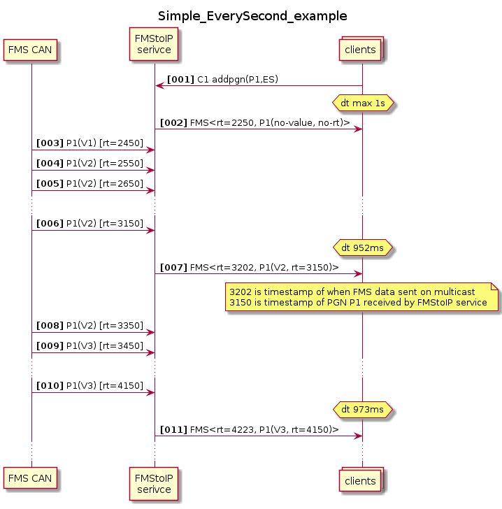
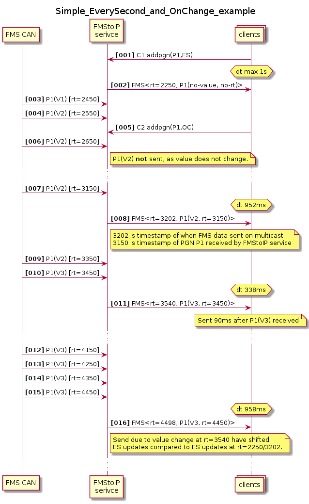
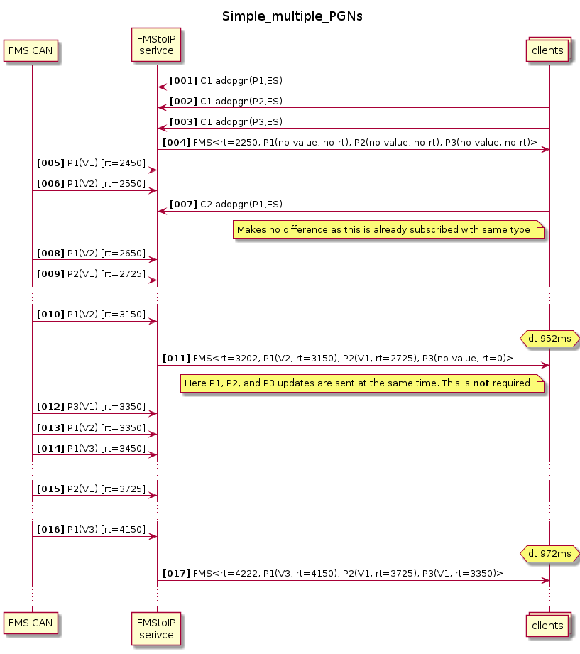
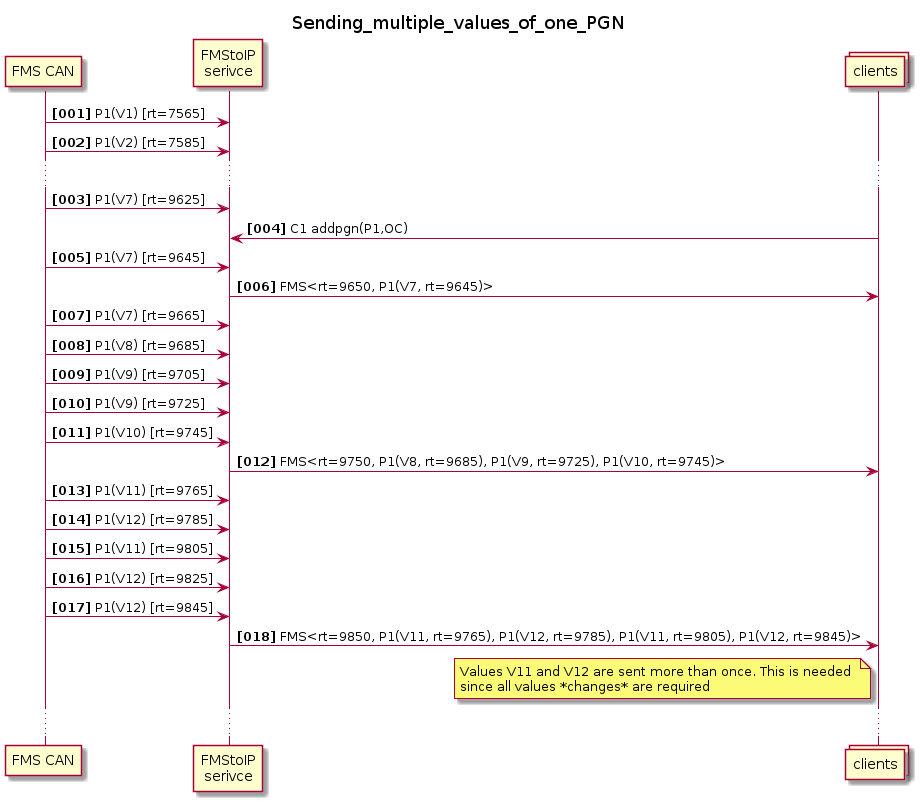
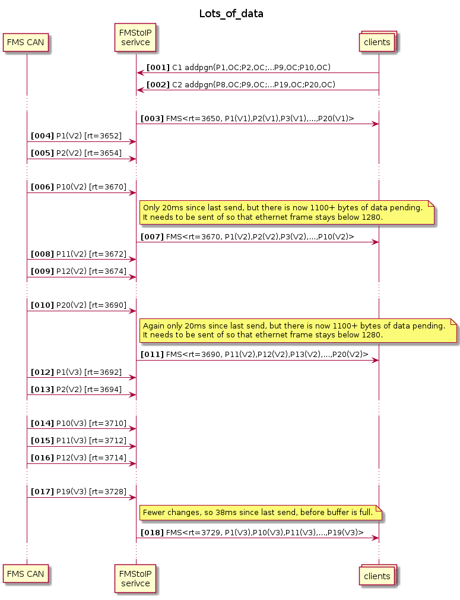
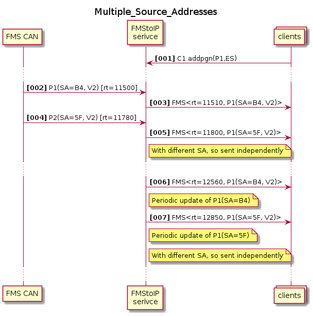

# FMStoIP Implementation Guide #

This document is the **FMStoIP Implementation Guide**. It contains examples, recommendations and advice for implementing an FMStoIP service or client.

This guide DOES NOT replace the FMStoIP specification, but contains information that is complementary to the specification. 

## Issues found in this guide ##

If you in this guide find things that are incorrect, confusing, or would be more helpful is stated in some other way, we ask that these be reported similarly to specification issues. 

## Should check txt-attributes ##

Applicable for: Client implementations

ToDo: Write something about checking txt-attributes. 

...

## ClientId ##

Applicable for: Client implementations

For compatibility reasons, ClientId in addpgn/removepgn requests is optional. But it is strongly recommended that all clients do provide a ClientId to prevent the possibility of conflict with existing or future clients on the same module.

It is up to each client to use something suitably unique. For one client the ClientId should be the same each time it starts. If it isn't, e.g. using PID (Process ID) as ClientId, then if the client (re)starts more often than the FMStoIP service the FMStoIP service list of registrations may grow uncontrollably. 

## SPN decode configuration example ##

Applicable for: Service implementations

The FMStoIP service specification requires that some aspects of SPN decode can be adjusted with Static Configuration. How this configuration is structured and done is an implementation detail. However as *example* the following JSON properties/values are provided. 
``` json
"SPNDecodeSpec": [],  # No SPNs are added in <Frame>
// or
"SPNDecodeSpec": [1234, 2345, 3456, 4567],  # These SPNs (but not others) are added in <Frame>
```

An FMStoIP service implementation is of course free to implement other values that define sets of SPNs. 

``` json
"SPNDecodeNameAndUnit": False,  # SPN contains only Value
// or
"SPNDecodeNameAndUnit": True,  # SPN contiains Name, Unit, and Value
```

It is recommended that the default values are
``` json
"SPNDecodeSpec": [],  # No SPNs are added in <Frame>
"SPNDecodeNameAndUnit": False,  # SPN contains only Value
```

## Telltales and other Block PGNs ##

Applicable for: Client implementations

The telltale PGN (PGN FD7D) has scheme where each frame has a different block ID and contains different information (with the same structure). 
Two vehicle implementations of this are known from the field: 
- Each A block is sent every 1000ms, which means all five blocks will be sent in 5s. 
- All blocks are sent every 1000ms

To ensure a consistent function across vehicles the Telltale PGN should always be registered with UpdatePolicy **OnChange** so that *all* telltales are received by the client. 

While FD7D is the only PGN with Blocks in the FMS standard, there are others outside the FMS specification. This implementation advice is probably valid for those as well.

## Timing implementation recommendation ##

Applicable for: Service implementations

Periodic sends (*not* caused by OnChange + value change) should be done at slightly above 1000ms (e.g. 1050ms) if the PGN have not been recently received, and at slightly below 1000ms (e.g. 950ms) if it has been recently received (e.g. within the last 200ms). 

This method will result in 1000ms repetition rate PGNs to be mostly sent once for every receive, and shortly after it has been received. 

(Note: Not reflected in example sequence diagrams below.)

## Provisioning service example sequences ##

Applicable for: Client and Service implementations

To assist in understanding the specification and the implementation of an FMStoIP service a number of sequence diagrams are provided. The sequence diagrams shows some situations that may be interesting. There is no intention that they show an optimal implementation, or even a possible implementation; all they are intended to do is to show is a sequence of messages that could clarify parts of the specification text. 

###	Notation in the diagrams ###

To keep diagrams short and readable P1/P2/P3/etc is used for different PGNs. V1/V2/V3/etc is used for different values of a PGN. rt is used for relative time, and dt for a delta-time between two events. ES and OC is used for EverySecond and OnChange respectively. C1/C2/C3/etc is used for different clients. 

The Default Minimum Set PGNs are mostly omitted to aid readability.

###	Simple EverySecond example ###


### Simple EverySecond and OnChange example ###
 

### Simple multiple PGNs ###
  

### Sending multiple values of one PGN ###
When subscribed OnChange, all value *changes* shall be transmitted, so the FMStoIP service may need to aggregate several values in one message to avoid generating to much traffic.

 
 
### A bit of everything ###
  

### Lots of data ###
This is a fairly synthetic example showing what happens when so much data is generated that it needs to be sent faster than 50ms between packets.
 
 

### Multiple source addresses ###
 
 


## Timing Example implementations ##

Applicable for: Service implementation

The two examples below show different ways to do an implementation of the FMStoIP service. To keep the examples reasonably readable they have been kept (relatively) simple. It is not guaranteed that they fulfil all requirements. An actual implementation would, very likely, need to be larger and more complex. 

### Periodic check ###
This example implementation saves incoming PGNs, and then sends them when it is necessary to not violate the timing requirements. This means latency will be highish but consistent. A "send-late" implementation.

Example below uses a few functions 

```
func PGNReceived(pgn-frame):
  - rt = clock_gettime(CLOCK_MONOTONIC)
  - IF PGN subscribed OnChange?
    - IF the value changed?
      - Add PGN to send-buffer
        - IF send-buffer full(ish)
          - Send()
  - Add pgn to last-seen buffer/cache
```

```
func PeriodicCheck():
  - rt = clock_gettime(CLOCK_MONOTONIC)
  - IF ANY pgn in send-buffer older than 70ms 
    OR ANY subscribed PGN not sent last 950ms?
      - FOR PGN in last-seen buffer 
        - Add oldest PGN first to send-buffer, then newer until send-buffer full or none older than 750ms
      - Send()
```

```
func Send():
  - rt = clock_gettime(CLOCK_MONOTONIC)
  - send PGNs in send-buffer
  - update last_send value in last-seen buffer for sent PGNs
  - clear send-buffer
```


### Send early ###
This example implementation sends incoming PGNs as soon as they arrive, unless it is less than 50ms since the last send, in case it waits. This means latency will be very low when few PGNs are subscribed, and then increase as the number of subscriptions - particularly OnChange subscriptions - increases. A "send-early" implementation. With a "medium" amount of subscriptions a send-early implementation would tend to send a few more Ethernet frames than a send-late implementation (but no more data, as frames will be smaller).

Example below uses a few functions

```
func PGNReceived(pgn-frame):
  - rt = clock_gettime(CLOCK_MONOTONIC)
  - IF PGN subscribed OnChange?
    - IF the value changed?
      - Add PGN to send-buffer
        - IF last-send > 50ms ago OR send-buffer full(ish)
          - FOR PGN in last-seen buffer 
          - Add oldest PGN first to send-buffer, then newer until send-buffer full or none older than 750ms
          - Send()
  - Add pgn to last-seen buffer/cache
```

```
func PeriodicCheck():
  - rt = clock_gettime(CLOCK_MONOTONIC)
  - IF last-send > 50ms ago
      - FOR PGN in last-seen buffer 
        - Add oldest PGN first to send-buffer, then newer until send-buffer full or none older than 750ms
      - IF anything in send-buffer
        - Send()  # If there is anything to send
    ELSE-IF size(send-buffer) + size(last-sent > 975ms) IS fullish
      - Add oldest PGN first to send-buffer, then newer until send-buffer full or none older than 750ms
      - Send()
```

```
func Send():
  - rt = clock_gettime(CLOCK_MONOTONIC)
  - send PGNs in send-buffer
  - update last_send value in last-seen buffer for sent PGNs
  - clear send-buffer
```


# Amount of traffic calculations #

Here are some simple summaries from the FMS standard:

The number of Frames/PGNs in the FMS standard (everything included) is 84. 

15 frames with 20/50ms update

3 frames with 50ms update

31 frames with 100ms update

28 frames with 1000ms update

7 frames with 10 000ms update

Counting the 20/50ms ones as 20ms there is a maximum number of 1155 CAN Frames on the bus per second. 

Assuming the each PGN update takes up 110bytes (which assumes no SPN decode), there is 10 messages per Ethernet frame (which is max 1280 as described above). 

Assuming every single PGN in FMS standard was subscribed EverySecond that is 9 Ethernet frames per second. 

Assuming every single PGN in FMS standard was subscribed OnChange AND that every PGN had a new value for each transmission (which would be 1155 changes each second), that is around 120 Ethernet frames per second. However these are unrealistic assumptions. A real world WORST CASE could - perhaps - be around 40 Ethernet frames per second. 


