# Content #

This files contains FMStoIP PlantUML diagrams that is used the spec, and 

## How to render these plant-uml sequence diagrams ##

Here is the method I use:

1. Install Visual Studio Code
2. Install Visual Studio Code extension "PlantUML"
3. Install Docker
4. Run, in a terminal `docker run -it -p 8080:8080 plantuml/plantuml-server:jetty`
5. In VS Code extensions Change "PlantUML" settings:
   - Renderer: **PlantUMLServer**
   - Server: http://localhost:8080
   - Export Format: **png**
   - Export Out Dir: **./**
6. Symbol in upper right corner for "Open Preview to the side" 
7. The images in preview cannot be copied to Word. Do Ctrl-Shift-P to get the command menu and write/select PlantUML: Export Current File Diagrams
8. Then replace images in word document with image on disk
9. Commit any updated diagrams to git (that are already in git)

# Configuration Service #

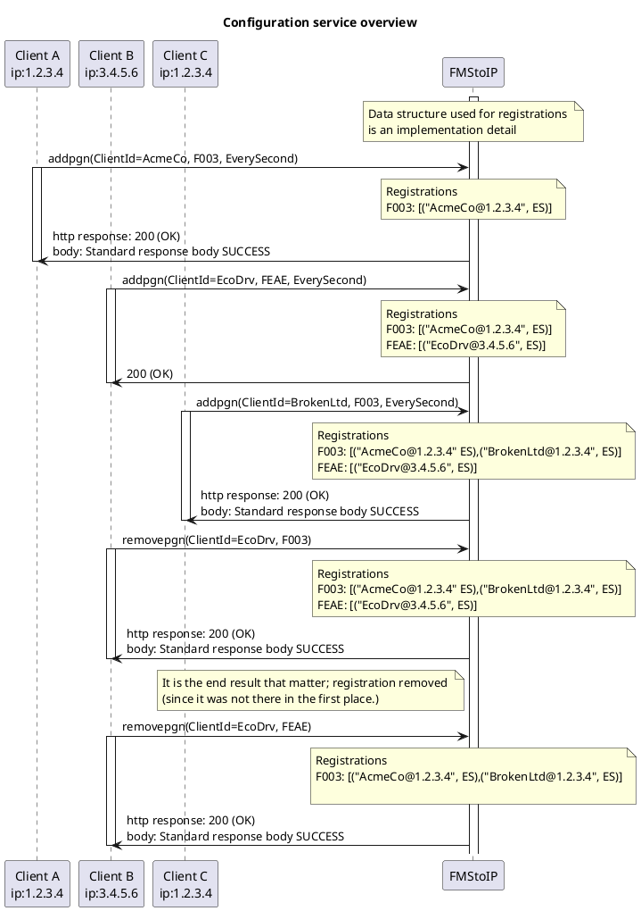

# Provisioning Service #

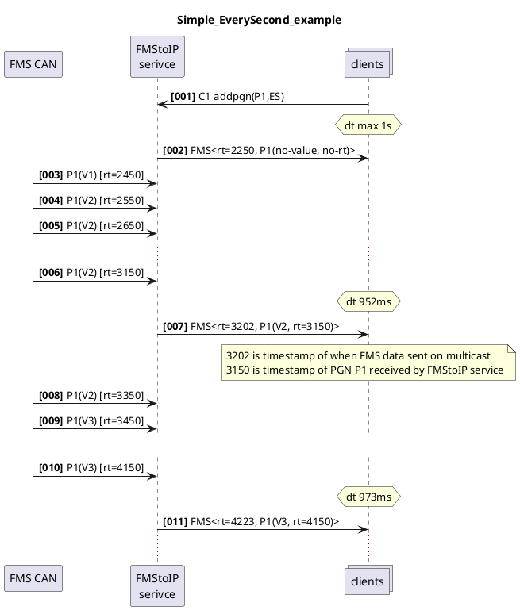

### Simple EverySecond and OnChange example ###

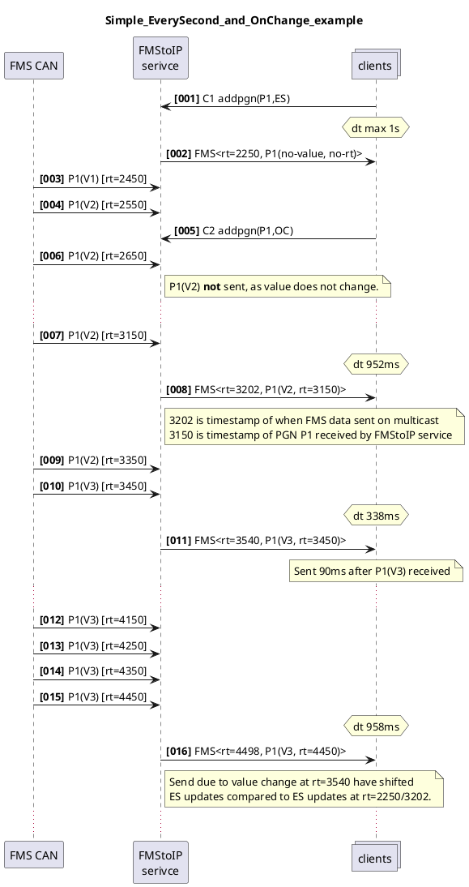

### Simple multiple PGNs ###

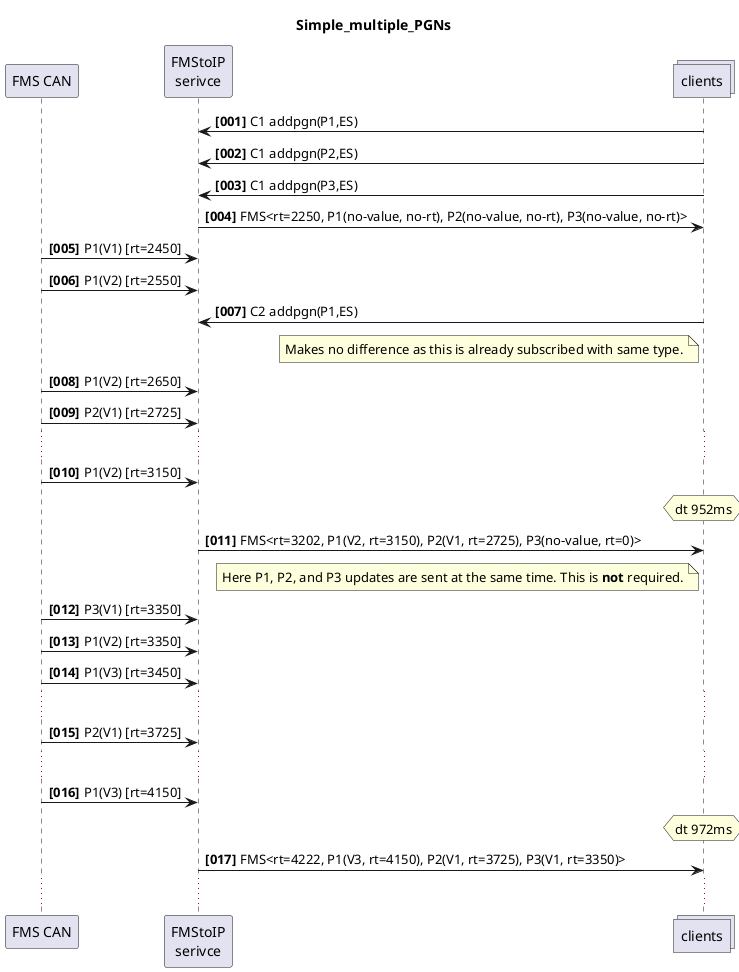

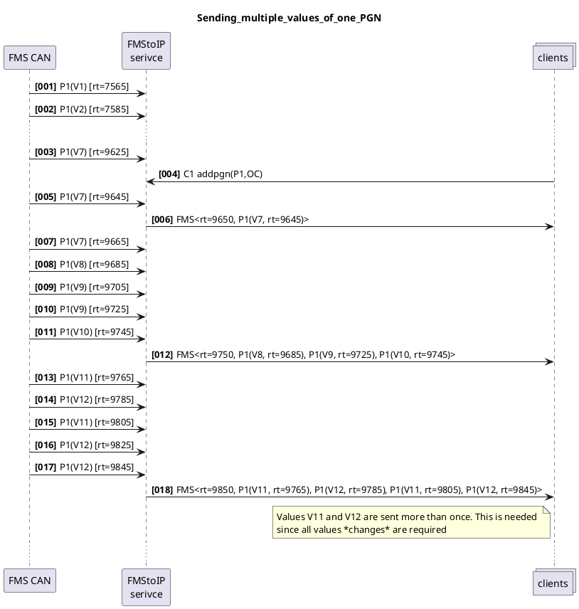

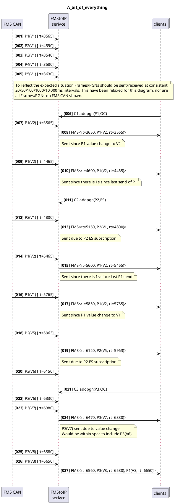

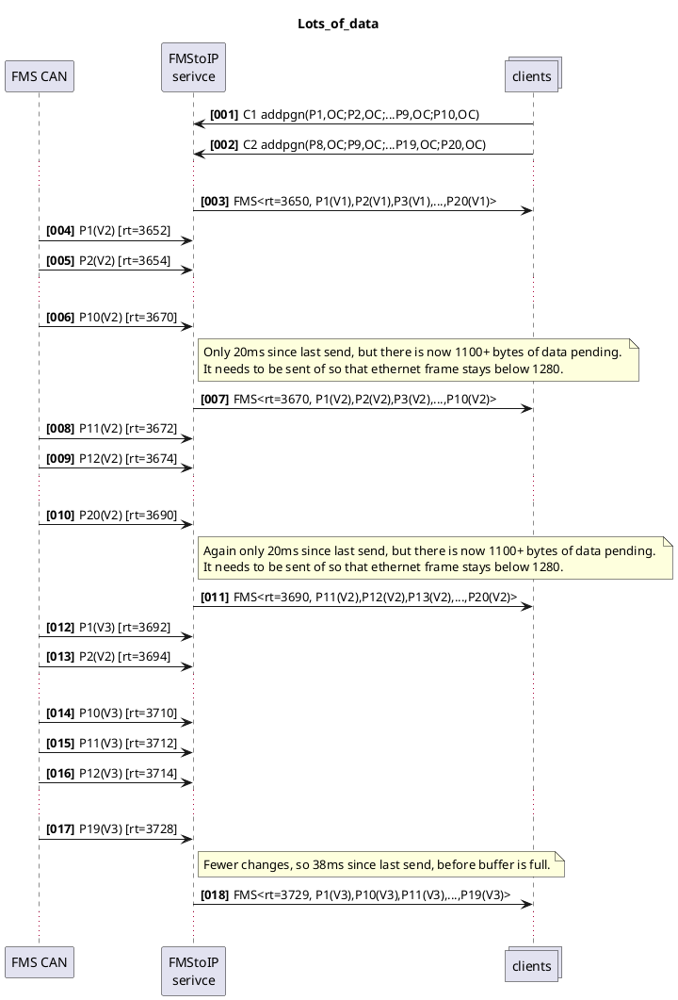

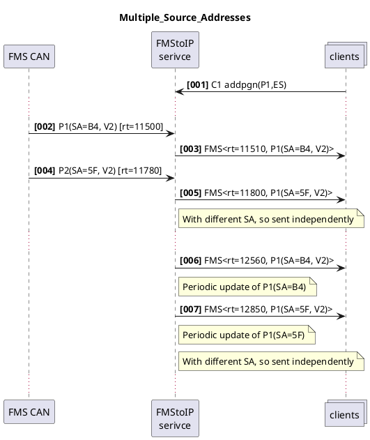

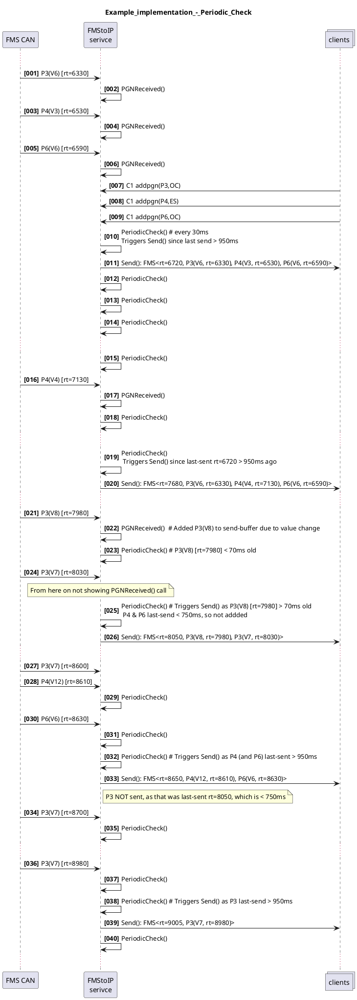

Diagrams still here, as they are source!

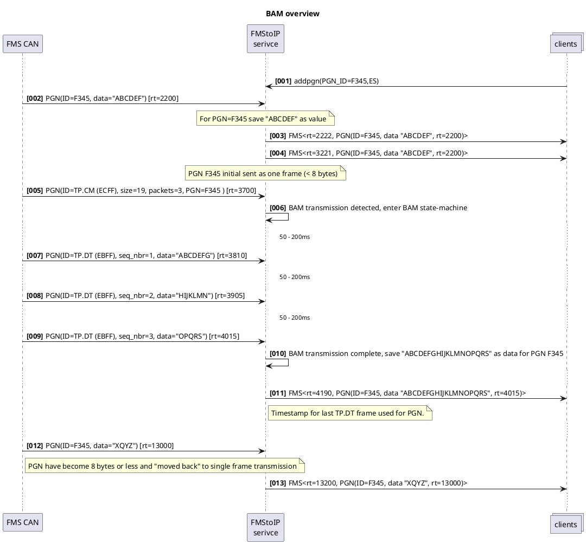

Diagram of "old" BAM data being sent halfway trough transmission of new BAM data:

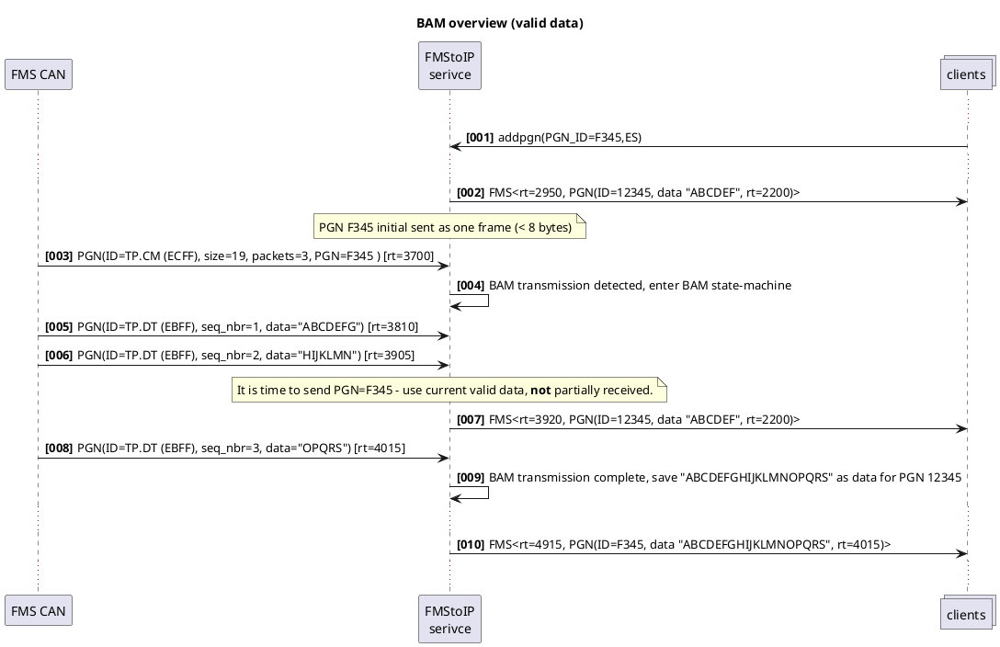

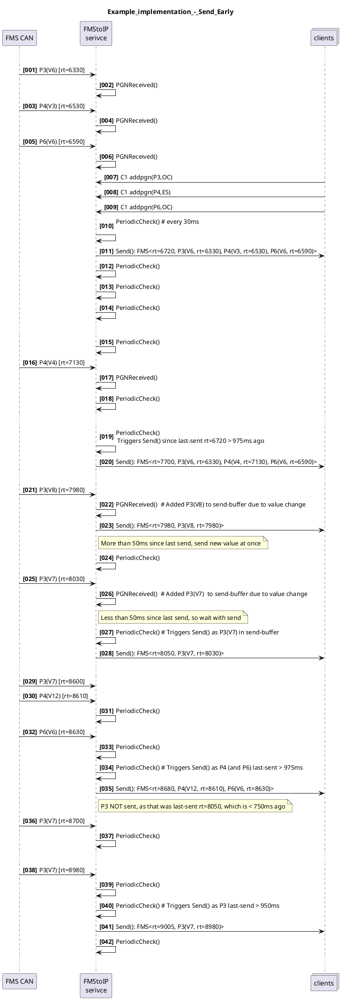

